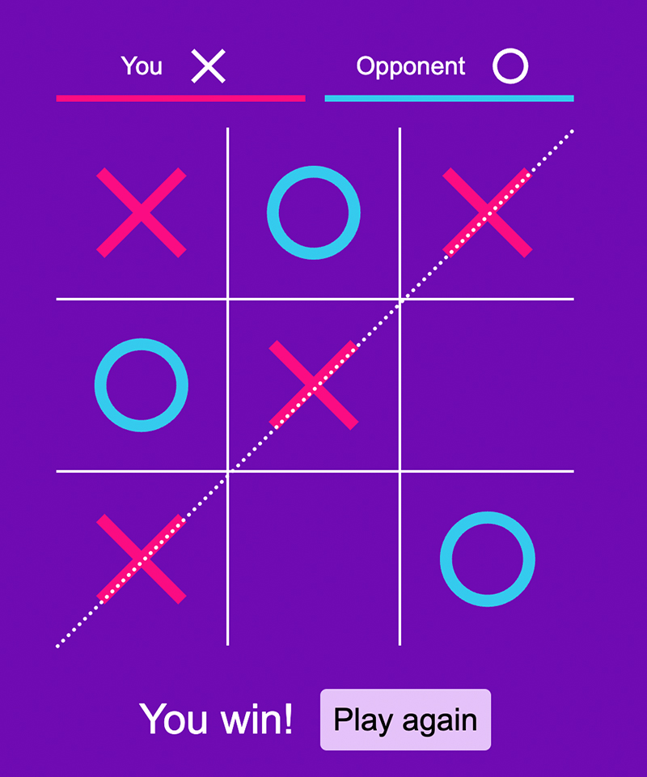

# Tic Tac Toe

This app implements a tic tac toe game of the user against the computer.

The game chooses a random player to start the game.
You have always the "X" and the opponent (computer) has always the "O".

The Game can finish with either a win, a loss or a draw.

It then prompts you for a new game.

_(Game screenshot)_

I hope you enjoy the game!

## AI

This game uses a modified minimax algorithm1.

The AI first checks\* if the computer can win on the next move, then checks if it has to prevent the player from winning in the next move.

If neither of the above apply, it then plays according to the minimax algorithm1.

I believe that you will find the overall AI behaviour quite competitive, resulting most of the times in a draw.

## Demo

A demo if this project is available here:

https://beamish-pasca-bf68cf.netlify.app/

## Instalation

A compiled version is ready in dist directory.

You will need to have npm installed in order to modify and rebuild.

> `$ npm install`

package.json comes with the following scripts:

> `$ npm run build`
>
> _Builds the dist folder in development mode_

> `$ npm run prod`
>
> _Builds the dist folder in production mode_
>
> _(The dist provided in this repo was made with this command)_

> `$ npm run dev`
>
> _Runs the app in a development server at localhost:3000_

## Note

This app is an excersise during my self education in web design. I focused more on the css/javascript part rather than the actual logic of the AI. My contribution in the AI was the addition of the initial check\* before using the minimax algorithm.

PL, 2022

---

## References

1 **Minimax Algorithm in Game Theory | Set 3 (Tic-Tac-Toe AI – Finding optimal move)**

https://www.geeksforgeeks.org/minimax-algorithm-in-game-theory-set-3-tic-tac-toe-ai-finding-optimal-move/
